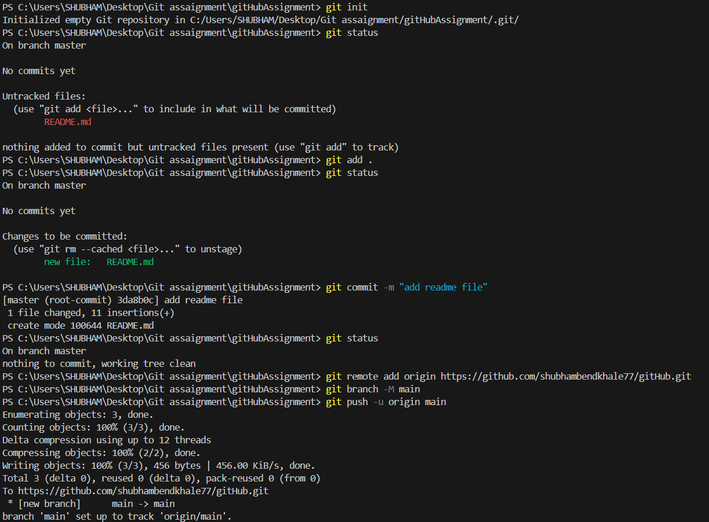
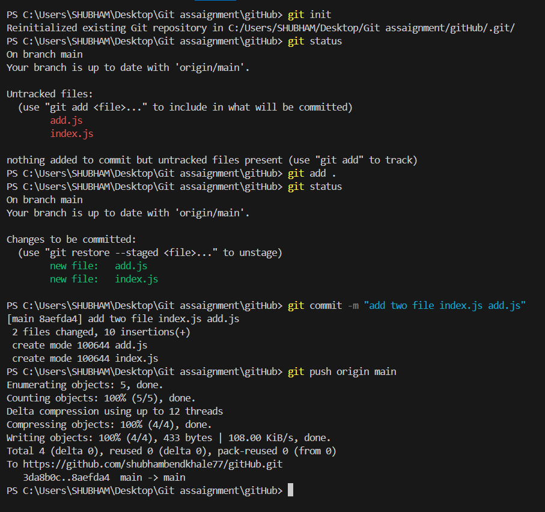
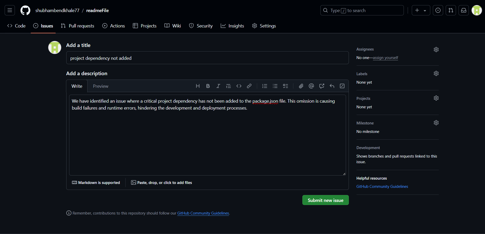
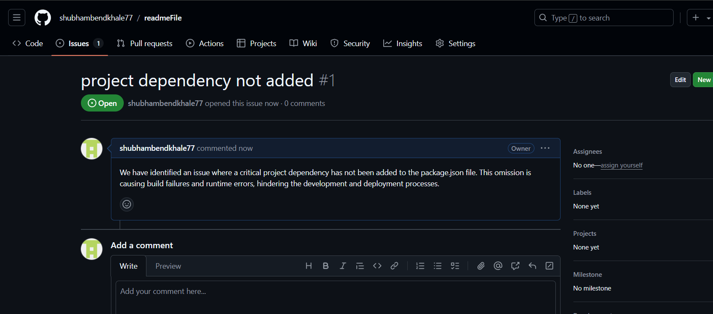
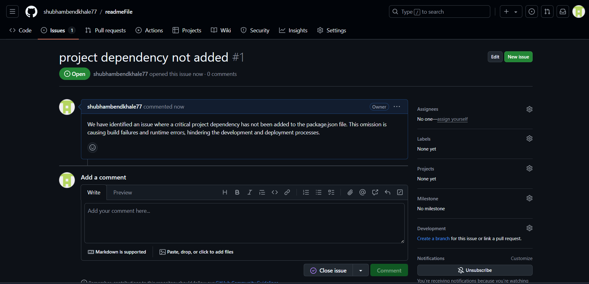
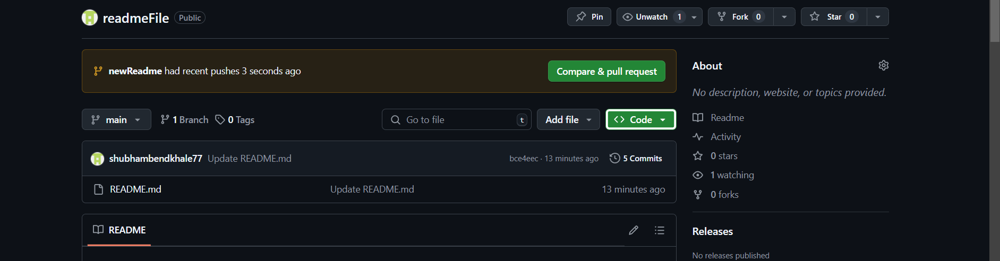

# Personal Task Manager

## Description
The Personal Task Manager is a web application designed to help users keep track of their tasks and stay organized. The application allows users to create, edit, and delete tasks. Each task can be marked as completed or pending, and users can view their tasks by status or due date.

## Features
- Create new tasks with titles, descriptions, and due dates.
- Edit and update existing tasks.
- Mark tasks as completed or pending.
- Filter tasks by status or due date.
- Responsive design for use on all devices.

## Setup Instructions
To set up the Personal Task Manager on your local machine, follow these steps:

## screenshots

### Q1. Create Your First Repository

### Q.2 Push Local Changes

### Q.3 Write an Issue

### Q.4 Create a Pull Request

## Usage Examples
Adding a New Task
Click on the "Add Task" button.

Enter the task details including title, description, and due date.

Click "Save" to add the task to your list.
Marking a Task as Completed
Find the task you want to mark as completed.

Click on the checkbox next to the task title.

The task will be moved to the completed section.

Filtering Tasks
Use the filter options at the top of the task list.

Select "Completed" to view only completed tasks, or "Pending" to view only pending tasks.

You
Create a README.md File

Objective: Write documentation for a project you would like to create.
Tools: Any text editor (e.g., Visual Studio Code, Notepad).
Task:
Draft a README.md file for your project.
Ensure it includes the project title, description, setup instructions, and usage examples.
Submit your README.md file via Google Docs for review.
Copilot
Sure thing! Here's a draft for a README.md file:

markdown

## Description
The Personal Task Manager is a web application designed to help users keep track of their tasks and stay organized. The application allows users to create, edit, and delete tasks. Each task can be marked as completed or pending, and users can view their tasks by status or due date.

## Contact
For any questions or suggestions, please reach out to shubhambendkhale77@gmail.com.com
